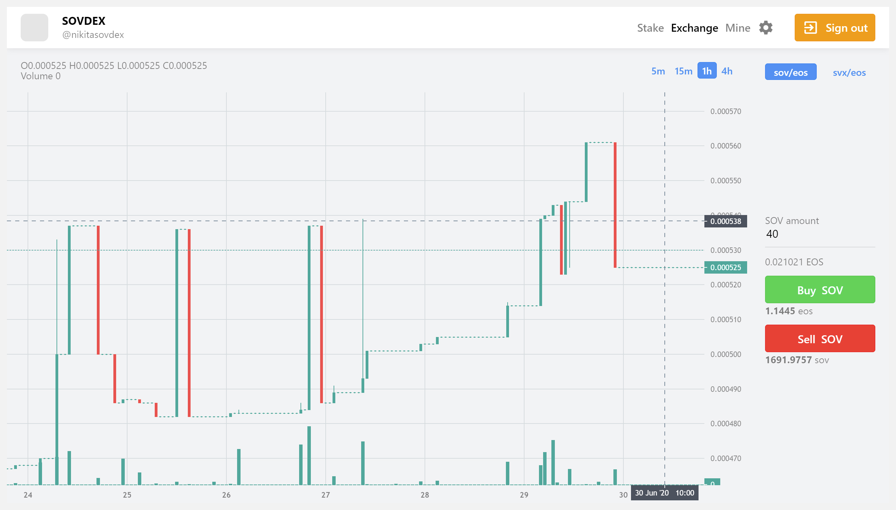

# SOVDEX

[Telegram community @eossov](https://t.me/eossov)

**SOVDEX** is an algorithmic instant liquidity exchange and SVX miner combined into one. Based on EOS blockchain.

You can also join our for more information and to have fun with the rest of the people involved in our projects. 



## For users 🖖

First you need to follow a few steps:

* Install [TokenPocket](https://www.tokenpocket.pro/en/) => Auth => set Private key
* [Open webapp](https://soveos.github.io/SOVDEX/) => press button "Login"

## For developers 😎

To organize app, we use solutions:

* [eosjs v16](https://github.com/EOSIO/eosjs) 
* [ScatterJS](https://github.com/GetScatter/scatter-js) - like MetaMask. Help to interact with blockchain
* [TokenPocket](https://www.tokenpocket.pro/en/) - DApp multi-tokens wallet

Feel free to contribute!

Required [Node.js](https://nodejs.org/en/)

```sh
$ yarn
```

### Run 

```sh
$ yarn run serve
```

### Build

```sh
$ yarn run build
```

## Contributors

<a href="https://github.com/marcius-studio">

</a>   

## Licence

[MIT](http://opensource.org/licenses/MIT)
